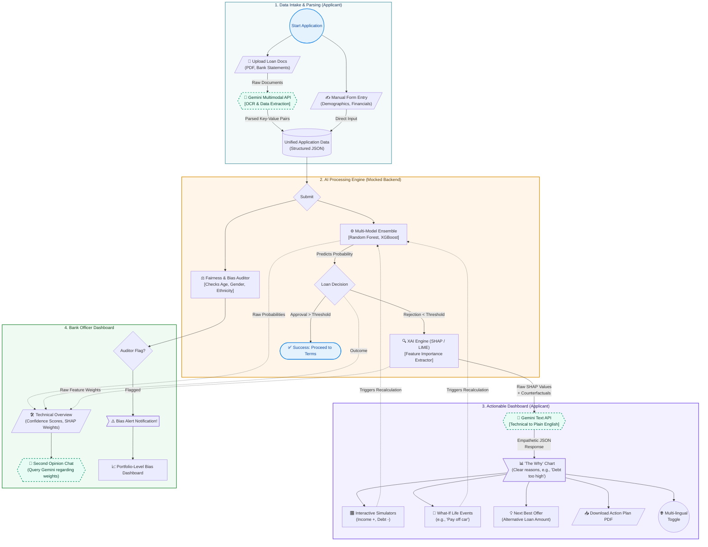

# XAI Loan Platform Architecture & Flow

This diagram illustrates the comprehensive user journey, data processing pipeline, and dual-dashboard system for the Applicant and Bank Officer. The flow is enhanced to show system boundaries and specific data structures.

